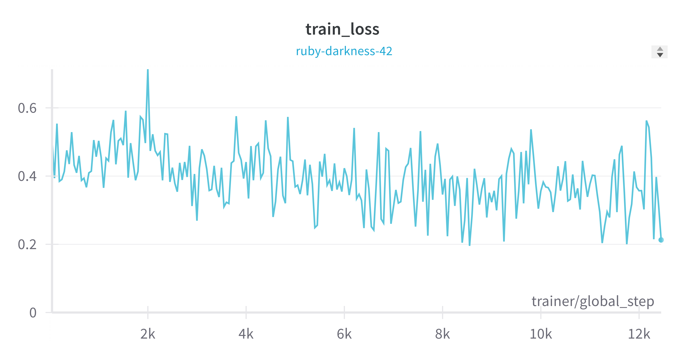
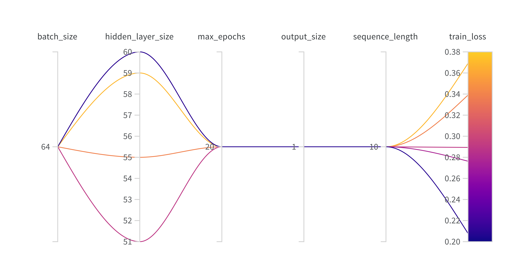

# Exam template for 02476 Machine Learning Operations

This is the report template for the exam. Please only remove the text formatted as with three dashes in front and behind
like:

```--- question 1 fill here ---```

where you instead should add your answers. Any other changes may have unwanted consequences when your report is auto
generated in the end of the course. For questions where you are asked to include images, start by adding the image to
the `figures` subfolder (please only use `.png`, `.jpg` or `.jpeg`) and then add the following code in your answer:

```markdown

```

In addition to this markdown file, we also provide the `report.py` script that provides two utility functions:

Running:

```bash
python report.py html
```

will generate an `.html` page of your report. After deadline for answering this template, we will autoscrape
everything in this `reports` folder and then use this utility to generate an `.html` page that will be your serve
as your final handin.

Running

```bash
python report.py check
```

will check your answers in this template against the constrains listed for each question e.g. is your answer too
short, too long, have you included an image when asked to.

For both functions to work it is important that you do not rename anything. The script have two dependencies that can
be installed with `pip install click markdown`.

## Overall project checklist

The checklist is *exhaustic* which means that it includes everything that you could possible do on the project in
relation the curricilum in this course. Therefore, we do not expect at all that you have checked of all boxes at the
end of the project.

### Week 1

* [x] Create a git repository
* [x] Make sure that all team members have write access to the github repository
* [x] Create a dedicated environment for you project to keep track of your packages
* [x] Create the initial file structure using cookiecutter
* [ ] Fill out the `make_dataset.py` file such that it downloads whatever data you need and
* [ ] Add a model file and a training script and get that running
* [ ] Remember to fill out the `requirements.txt` file with whatever dependencies that you are using
* [x] Remember to comply with good coding practices (`pep8`) while doing the project
* [ ] Do a bit of code typing and remember to document essential parts of your code
* [ ] Setup version control for your data or part of your data
* [ ] Construct one or multiple docker files for your code
* [ ] Build the docker files locally and make sure they work as intended
* [ ] Write one or multiple configurations files for your experiments
* [ ] Used Hydra to load the configurations and manage your hyperparameters
* [ ] When you have something that works somewhat, remember at some point to to some profiling and see if
      you can optimize your code
* [ ] Use Weights & Biases to log training progress and other important metrics/artifacts in your code. Additionally,
      consider running a hyperparameter optimization sweep.
* [ ] Use Pytorch-lightning (if applicable) to reduce the amount of boilerplate in your code

### Week 2

* [ ] Write unit tests related to the data part of your code
* [ ] Write unit tests related to model construction and or model training
* [ ] Calculate the coverage.
* [ ] Get some continuous integration running on the github repository
* [ ] Create a data storage in GCP Bucket for you data and preferable link this with your data version control setup
* [ ] Create a trigger workflow for automatically building your docker images
* [ ] Get your model training in GCP using either the Engine or Vertex AI
* [ ] Create a FastAPI application that can do inference using your model
* [ ] If applicable, consider deploying the model locally using torchserve
* [ ] Deploy your model in GCP using either Functions or Run as the backend

### Week 3

* [ ] Check how robust your model is towards data drifting
* [ ] Setup monitoring for the system telemetry of your deployed model
* [ ] Setup monitoring for the performance of your deployed model
* [ ] If applicable, play around with distributed data loading
* [ ] If applicable, play around with distributed model training
* [ ] Play around with quantization, compilation and pruning for you trained models to increase inference speed

### Additional

* [ ] Revisit your initial project description. Did the project turn out as you wanted?
* [ ] Make sure all group members have a understanding about all parts of the project
* [ ] Uploaded all your code to github

## Group information

### Question 1
> **Enter the group number you signed up on <learn.inside.dtu.dk>**
>
> Answer:
50

### Question 2
> **Enter the study number for each member in the group**
>
> Example:
>
> *sXXXXXX, sXXXXXX, sXXXXXX*
>
> Answer:
S240446, s212074, s240490, s240505

### Question 3
> **What framework did you choose to work with and did it help you complete the project?**
>
> Answer length: 100-200 words.
>
> Example:
> *We used the third-party framework ... in our project. We used functionality ... and functionality ... from the*
> *package to do ... and ... in our project*.
>
> Answer:
Docker: "PC Setup" inside the docker file
Conda: Package manager
GCP:
- Cloud Storage: Stores data for dvc pull
- Artifact Registry: Stores built docker images (can be created into container)
- Compute Engine: Enables creating virtual machines
- Functions / Run: Deployment
- Vertex AI: includes virtual machines, training of AI models ("abstraction above VM...")
OmegaConf: Handle the config data for train_model.py
CookieCutter: Template used for generating code sctructure
DVC: Data versioning tool, similar is github but for data
GitHub: Versioning tool for written code, GitHub Actions runs pytest, Codecov, upload built docker images to GCP
Pytest: Runs some tests to check whether the code is working
CodeCov: Tool for uploading coverage report from pytest as a comment to pull requests
Weight and Biases: wandb, used for storing and tracking the trained model
Pytorch Lightning: Framework for training our LTSM model and storing default config values, significantly reduced boilerplate
Forecasting: Abstracion above Pytorch Lightning working with Timeseries data (he results weren’t satisfying, so we leveraged the Pytorch LSTM module)

## Coding environment

> In the following section we are interested in learning more about you local development environment.

### Question 4
> **Explain how you managed dependencies in your project? Explain the process a new team member would have to go**
> **through to get an exact copy of your environment.**
>
> Answer length: 100-200 words
>
> Example:
> *We used ... for managing our dependencies. The list of dependencies was auto-generated using ... . To get a*
> *complete copy of our development environment, one would have to run the following commands*
>
> Answer:
We use Conda within our Docker containers for managing dependencies. To get a
complete copy of our development environment, we offer two methods:

The first method involves creating a Conda environment, installing
dependencies, and downloading the data:
```
git clone https://github.com/malek-luky/Automatic-Wheel-Assembly-Detection.git
cd Automatic-Wheel-Assembly-Detection
make conda
```

The second method uses Docker. This approach builds an image of our project
and runs it in a container, which includes all dependencies, data, and code
necessary for running the project. We offer two options for this:

Option 1:
Build the container locally after downloading the repository. The WANDB_API_KEY is necessary only for train_model dockerfile.
```
git clone https://github.com/malek-luky/Automatic-Wheel-Assembly-Detection.git
cd Automatic-Wheel-Assembly-Detection
docker build -f dockerfiles/<train_model/conda_setup/deploy_model>.dockerfile . -t trainer:latest
```

Option 2:
```
make docker_<conda/train/deplot>_online
```


### Question 5
> **We expect that you initialized your project using the cookiecutter template. Explain the overall structure of your**
> **code. Did you fill out every folder or only a subset?**
>
> Answer length: 100-200 words
>
> Example:
> *From the cookiecutter template we have filled out the ... , ... and ... folder. We have removed the ... folder*
> *because we did not use any ... in our project. We have added an ... folder that contains ... for running our*
> *experiments.*
> Answer:
We initialised our project with a cookiecutter template. We added folders /torchserve and /serve_model for supporting local and cloud model deployment respectively. We added a folder src/models/config for storing hyper parameters locally. We renamed the project folder to `src`, where all the necessary source files for data and model usage are stored. 
The models folder in the root is used for storing the saved models.
The tests folder contains unit tests for data and model correctness.
The .github/workflows folder contains workflows that are executed either on pull requests or pushes to main.
The .dvc folder contains configuration for DVC usage.
The dockerfiles folder contains three docker files with the instruction for building docker images. For more information visit the end of the README where everything is explained in much more details.


### Question 6
> **Did you implement any rules for code quality and format? Additionally, explain with your own words why these**
> **concepts matters in larger projects.**
>
> Answer length: 50-100 words.
>
> Answer:
In our project we established the GitHub Pre-commit to ensure code quality 
and formatting. The pre-commit configuration file prevents the pushing of
large files to the repository, checks for trailing whitespaces, correctly
fixes the ends of files, and sorts packages in requirements.txt 
alphabetically. Moreover we utilize ruff to check and auto-format most code
inconsistencies to conform with the PEP8 standard. Lastly, pre-commit uses
the isort package to properly organize imports in Python scripts.


## Version control
> In the following section we are interested in how version control was used in your project during development to
> corporate and increase the quality of your code.


### Question 7
> **How many tests did you implement and what are they testing in your code?**
>
> Answer length: 50-100 words.
>
> Example:
> *In total we have implemented X tests. Primarily we are testing ... and ... as these the most critical parts of our*
> *application but also ... .*
>
> Answer:
We implemented 5 tests in total. Primarily we are testing the data from the dataset, checking its dimension, the size of every data sample, the correctness of data storage. We also test the model structure by evaluating the output shape, the correctness of the hyperparameters and the correctness of data samples partitioning.  


### Question 8
> **What is the total code coverage (in percentage) of your code? If you code had an code coverage of 100% (or close**
> **to), would you still trust it to be error free? Explain you reasoning.**
>
> Answer length: 100-200 words.
>
> Example:
> *The total code coverage of code is X%, which includes all our source code. We are far from 100% coverage of our **
> *code and even if we were then...*
>
> Answer:
We are reaching coverage of 100%, which includes all of our source code. But it definitely does not mean that the code is error free. It all comes to the quality of the tests themselves. Even if we write the best possible tests we can think of, there migh still be some special situations which we did not consider. So no, we cannot trust it to be error free. But if the coverage is 100% and the tests are good, we could be fairly confident. We test only basic principles in our model and there are definitely more tests to be implemented. Therefore even after reaching 100% we cannot fully trust the code to be error free. We are using codecov, taht automatically sends the coverage report as a comment on every pull request. It was working until PR #13, then it stopped working and although both the GitHub action workflow is the same, there is an issue with generating the coverage report inside the filesystem.


### Question 9
> **Did you workflow include using branches and pull requests? If yes, explain how. If not, explain how branches and**
> **pull request can help improve version control.**
>
> Answer length: 100-200 words.
>
> Example:
> *We made use of both branches and PRs in our project. In our group, each member had an branch that they worked on in*
> *addition to the main branch. To merge code we ...*
>
> Answer:
We developed features on separate branches, creating pull requests for frequent merges into the main branch. This streamlined our process, minimising the risk of excessive branches and reducing potential merge conflicts. The ownner of the repository also locked the main branch for direct commits, therefore everything going to the main branch was done using PR. For PR we forced the squash commit. Therefore most of the pushes (except the forced ones) to the main branch have a PR with description what was implemented in this features. This approach gives us better control over the code. Also, we implemented one workflow so that on every pull request to the main branch it conducts tests from the /tests folder. There are other three workflows for pushes to the main branch: first one builds and pushes the  docker training image and runs Vertex AI Job; the second one builds and pushes docker conda image to GCP Artifact Registry; the third one builds and deploys our model to Cloud Run. 


### Question 10
> **Did you use DVC for managing data in your project? If yes, then how did it improve your project to have version**
> **control of your data. If no, explain a case where it would be beneficial to have version control of your data.**
>
> Answer length: 100-200 words.
>
> Example:
> *We did make use of DVC in the following way: ... . In the end it helped us in ... for controlling ... part of our*
> *pipeline*
>
> Answer:
Yes, we are using dvc for version control. Since our project relies on manually labeled data from the lab, versioning makes perfect sense. We can receive new data on a daily basis and version it, so then we want to reproduce model training from last month to find a glitch for example in the model we trainer a month ago, we can easily do it. We just need to find the correct data label from that day and download new dataset for the training. However, since the lab gave us only initial meassurements in the first week of the course. We did not try out this feature. Also, more data would be very helpful for us, sicne the main problem with the model was a lack of data.


### Question 11
> **Discuss you continues integration setup. What kind of CI are you running (unittesting, linting, etc.)? Do you test**
> **multiple operating systems, python version etc. Do you make use of caching? Feel free to insert a link to one of**
> **your github actions workflow.**
>
> Answer length: 200-300 words.
>
> Example:
> *We have organized our CI into 3 separate files: one for doing ..., one for running ... testing and one for running*
> *... . In particular for our ..., we used ... .An example of a triggered workflow can be seen here: <weblink>*
>
> Answer:
We have four workflows in total:
- Deploy an image of the entire project to artifact registry, so that it can be run via a Virtual Machine in the cloud. 
- Deploy an image of the training script and all its dependencies and train a new model using Vertex AI
- Deploy an image of our hosted model using FastAPI and uvicorn and deploy it to Cloud Run.
- Unit testing workflow using pytest

Every single one of these workflows is executed when there are changes in the main branch. Since our main is locked to pushes only via PR and is protected. One can only push changes that don't break our unit testing module. At the current stage we test only the model and data. For instance, we check that the model architecture has not been ruined by passing an example input and checking for an expected output shape. An example of a workflow that deployes our model to cloud run can be seen [here](https://github.com/malek-luky/Automatic-Wheel-Assembly-Detection/blob/main/.github/workflows/build_deploy.yml). 

To ensure that we follow good coding standards, we also have a pre-commitizer setup in the repo, to ensure a good quality of the code (e.g. trailing whitespaces, not unused imports etc.). This does not allow you to commit a change 
tah


## Running code and tracking experiments
> In the following section we are interested in learning more about the experimental setup for running your code and
> especially the reproducibility of your experiments.

### Question 12
> **How did you configure experiments? Did you make use of config files? Explain with coding examples of how you would**
> **run a experiment.**
>
> Answer length: 50-100 words.
>
> Example:
> *We used a simple argparser, that worked in the following way: python my_script.py --lr 1e-3 --batch_size 25*
>
> Answer:
The hyperparameters are stored under/config/default_config.yaml and by default are loaded to the training script with the use of omegaconf. The stored parameters are the number of epochs, batch size, size of a hidden layer, output size and sequence length. We implemented CLI with `click` to choose different training modes. Running the script with 
```bash
python src/models/train_model.py --sweep
```
results in hyper parameters optimization by `wandb`, where parameters are initialised with `wandb.config`.


### Question 13
> **Reproducibility of experiments are important. Related to the last question, how did you secure that no information**
> **is lost when running experiments and that your experiments are reproducible?**
>
> Answer length: 100-200 words.
>
> Example:
> *We made use of config files. Whenever an experiment is run the following happens: ... . To reproduce an experiment*
> *one would have to do ...*
>
> Answer:
To be sure that our tests are reproducible, we need two things: exactly same software and ideally also exactly the same hardware. For the software side of view, we are using versiong on GitHub, config files using OmegaConf and dvc for data. This ensures that at any point in the time, we can get exactly the same setup to reproduce the model.

On the other hand, when it comes to hardware, shipping entire computer is not an easy (and right thing) to do. For that, we are using Docker. Inside the dockerfile, we exactly specify what setup we are using. The packages are described inside the environemnt.yml (since our docker is using conda which can often automatically solve the conflicts between packages). Therefore when we want to reproduce our meassurements. Not only that we have exactly the specs of our computer, but even if we decide to use e.g. different packages, entrypoint or whatever you can change inside the dockerfile, we can just checkout the commmit on git and reproduce the experiment from the past.


### Question 14


> **Upload 1 to 3 screenshots that show the experiments that you have done in W&B (or another experiment tracking**
> **service of your choice). This may include loss graphs, logged images, hyperparameter sweeps etc. You can take**
> **inspiration from [this figure](figures/wandb.png). Explain what metrics you are tracking and why they are**
> **important.**
>
> Answer length: 200-300 words + 1 to 3 screenshots.
>
> Example:
> *As seen in the first image when have tracked ... and ... which both inform us about ... in our experiments.*
> *As seen in the second image we are also tracking ... and ...*
>
> Answer:
We primarily use Weights and Biases service for monitoring the progress of the experiments. Here you can see an example of the training loss we captured, which is one of the metrics we measure. The training loss provides information of how well our model is learning, and our objective is to minimise it. Although this metric is essential for tracking the learning progress of the model, due to the lack of data for a proper training, the training loss curve might not seem as decreasing as it would have been desired.



Another metric we track is the training accuracy, which in contrast to training loss demonstrates how well the model is classifying the target values. Again, the shown graph is far from demonstrating a perfect result after training, although the resulting 78 % is a quite good value. Ideally by monitoring the loss and accuracy we should be able to fine-tune our model and achieve better results.

 


We were performing hyper parameters optimization with the `wandb` `sweep` feature. The result can be seen in the following picture. The tuning parameter was the size of the hidden layer and the objective was to minimise the training loss. 


### Question 15
> **Docker is an important tool for creating containerized applications. Explain how you used docker in your**
> **experiments? Include how you would run your docker images and include a link to one of your docker files.**
>
> Answer length: 100-200 words.
>
> Example:
> *For our project we developed several images: one for training, inference and deployment. For example to run the*
> *training docker image: `docker run trainer:latest lr=1e-3 batch_size=64`. Link to docker file: <weblink>*
>
> Answer:
We have three different dockerfiles. First one is used for training the model (https://github.com/malek-luky/Automatic-Wheel-Assembly-Detection/blob/main/dockerfiles/train_model.dockerfile). This file downloads all the required packages and starts the training script, which trains the model and uploads it to wandb. The second docker file deploy the model to Cloud Run (https://github.com/malek-luky/Automatic-Wheel-Assembly-Detection/blob/main/.github/workflows/build_deploy.yml). The cloud run starts this dockerfile, which executes the script that responsible for downloading the newest model and predict the result based on the input for the user. The third dockerfile is jsut for testing. It download the packages and waits. This allows the user to log into the docker using interactive mode for debugging for example. Otherwise the docker image exits after it's finished.

The images can be run with the following commands:
```
docker run train_model:latest
docker run conda_setup:latest
docker run deploy__model:latest
```


### Question 16
> **When running into bugs while trying to run your experiments, how did you perform debugging? Additionally, did you**
> **try to profile your code or do you think it is already perfect?**
>
> Answer length: 100-200 words.
>
> Example:
> *Debugging method was dependent on group member. Some just used ... and others used ... . We did a single profiling*
> *run of our main code at some point that showed ...*
>
> Answer:
Based on the spectrum of work each group member was working on, the debugging methods were differing. Mostly when encountering bugs in the code during experiments, all of us used the debugging approach that involved first reviewing the code and error messages for issue identification. Locally, we utilised the built-in debugger in Visual Studio Code and employed print statements when needed. Some of us were also consulting TAs on the slack channel of this course, when the source of the bug was unclear. Some of the problems were solved by properly reading online documentation for the used packages or diving into their source codes.


## Working in the cloud
> In the following section we would like to know more about your experience when developing in the cloud.


### Question 17
> **List all the GCP services that you made use of in your project and shortly explain what each service does?**
>
> Answer length: 50-200 words.
>
> Example:
> *We used the following two services: Engine and Bucket. Engine is used for... and Bucket is used for...*
>
> Answer:
We are using Cloud Storage for storing data for dvc pull. THe Artifact Registry is responsible for storing built docker images. Compute Engine enables creating virtual machines, which we used before moving to Vertex AI. Functions and Run were used for Model Deployment (here we are using Run, as it is more robust. And last one on the list is Vertex AI which is responsible for training of AI models ("abstraction above VM...").


### Question 18


> **The backbone of GCP is the Compute engine. Explained how you made use of this service and what type of VMs**
> **you used?**
>
> Answer length: 100-200 words.
>
> Example:
> *We used the compute engine to run our ... . We used instances with the following hardware: ... and we started the*
> *using a custom container: ...*
>
> Answer:
We used the VM mchine for building the dockerimages and running the training for our model. Luckily, in our case the training was rather fast, since we were using very simple model and a small dataset. But in case we have a huge model and enormous ammount of data, running it locally would mean we cannot use the PC for quite some time and also the computational power would not be sufficient. VM offer us to customize the machine to our needs and use even TPUs, which are specially made for machine leardning computations. For our project we weere using the following settings:Compute-optimized, Series: C2D, Machine Type: c2d-standard-4 (must have at least 16GB RAM), Boot disk: 40 GB (it needs a lot!). Everything was deployed with a custom container image, mostly the dockerfile for training.


### Question 19


> **Insert 1-2 images of your GCP bucket, such that we can see what data you have stored in it.**
> **You can take inspiration from [this figure](figures/bucket.png).**
>
> Answer:
[bucket](figures/team_bucket.png)


### Question 20


> **Upload one image of your GCP container registry, such that we can see the different images that you have stored.**
> **You can take inspiration from [this figure](figures/registry.png).**
>
> Answer:

[registry](figures/team_registry.png)

### Question 21


> **Upload one image of your GCP cloud build history, so we can see the history of the images that have been build in**
> **your project. You can take inspiration from [this figure](figures/build.png).**
>
> Answer:
We were facing issues with building the image in GCP. Therefore after a discussino with Nicki we built the image using GitHub Actions and stored it to Artifact registry.

[build](figures/team_build.png)
[build](figures/team_build2.png)


### Question 22


> **Did you manage to deploy your model, either in locally or cloud? If not, describe why. If yes, describe how and**
> **preferably how you invoke your deployed service?**
>
> Answer length: 100-200 words.
>
> Example:
> *For deployment we wrapped our model into application using ... . We first tried locally serving the model, which*
> *worked. Afterwards we deployed it in the cloud, using ... . To invoke the service an user would call*
> *`curl -X POST -F "file=@file.json"<weburl>`*
>
> Answer:


We managed to deploy our model both locally and in the cloud. For local deployment we utilised such packages as `torchserve` and `curl`.  For this purpose it was also needed to implement our own `handler` for `torch-model-archiver`. The guidelines for local deployment are stored in the README.md under /torchserve. To get predictions from the local server, one would call 
```bash
curl http://127.0.0.1:8080/predictions/TireAssemblyLSTM -T example_tensor.txt 
```

Our cloud model is hosted using cloud run. You can make a prediction in your terminal by doing. It's a cold run, therefore it takes some time to start the server.
```
curl -X 'POST' \
  'https://deployed-model-service-t2tcujqlqq-ew.a.run.app/predict' \
  -H 'accept: application/json' \
  -H 'Content-Type: application/json' \
  -d '{
    "sequence": <INSERT-YOUR-DATA> (example is in README)
}
```
You can check the online documentation for the endpoints here. There are 3 endpoints:
```
/ root welcomes the user
/healthcheck typical healthcheck
/predict POST prediction endpoint
```
The app every 6 hours checks for an updated trained model (i.e. a new trained model that was created by calling our training script) and uses it for future predictions. On every push to main, the hosting is automatically re-deployed in cloud run.
 


### Question 23
> **Did you manage to implement monitoring of your deployed model? If yes, explain how it works. If not, explain how**
> **monitoring would help the longevity of your application.**
>
> Answer length: 100-200 words.
>
> Example:
> *We did not manage to implement monitoring. We would like to have monitoring implemented such that over time we could*
> *measure ... and ... that would inform us about this ... behaviour of our application.*
>
> Answer:


--- question 23 fill here ---


### Question 24


> **How many credits did you end up using during the project and what service was most expensive?**
>
> Answer length: 25-100 words.
>
> Example:
> *Group member 1 used ..., Group member 2 used ..., in total ... credits was spend during development. The service*
> *costing the most was ... due to ...*
>
> Answer:


--- question 24 fill here ---


## Overall discussion of project


> In the following section we would like you to think about the general structure of your project.


### Question 25


> **Include a figure that describes the overall architecture of your system and what services that you make use of.**
> **You can take inspiration from [this figure](figures/overview.png). Additionally in your own words, explain the**
> **overall steps in figure.**
>
> Answer length: 200-400 words
>
> Example:
>
> *The starting point of the diagram is our local setup, where we integrated ... and ... and ... into our code.*
> *Whenever we commit code and puch to github, it auto triggers ... and ... . From there the diagram shows ...*
>
> Answer:


--- question 25 fill here ---


### Question 26


> **Discuss the overall struggles of the project. Where did you spend most time and what did you do to overcome these**
> **challenges?**
>
> Answer length: 200-400 words.
>
> Example:
> *The biggest challenges in the project was using ... tool to do ... . The reason for this was ...*
>
> Answer:


The first challenge we encountered was creating a custom architecture for our model, as our study case was quite unique. Our first approach was to implement the model with `TemporalFusionTransformer` using Pytorch Forecasting, but this didn’t bring positive results, so we switched to pure Pytorch instead. 
#TODO: add your challenges 


### Question 27


> **State the individual contributions of each team member. This is required information from DTU, because we need to**
> **make sure all members contributed actively to the project**
>
> Answer length: 50-200 words.
>
> Example:
> *Student sXXXXXX was in charge of developing of setting up the initial cookie cutter project and developing of the*
> *docker containers for training our applications.*
> *Student sXXXXXX was in charge of training our models in the cloud and deploying them afterwards.*
> *All members contributed to code by...*
>
> Answer:


Student s240446 (Liza) provided dataset, contributed to unit tests, wandb setup and sweeping, CLI, config files, report filing, implemented local deployment with torchserve. 
Student s240490 (Vratislav) implementation of the data processing pipeline, pre-commit setup, documentation, report filling
Student … (Lukas)
Student … (Lukas)


