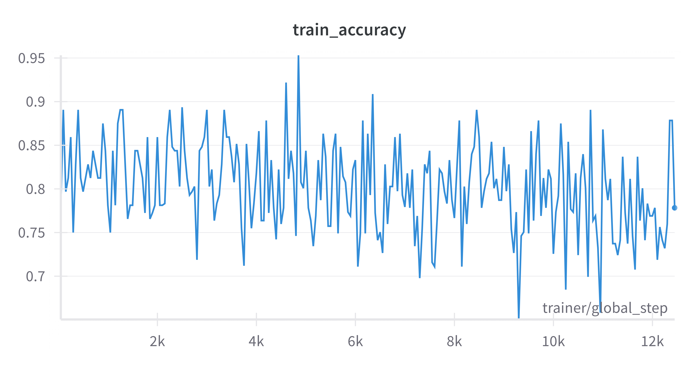
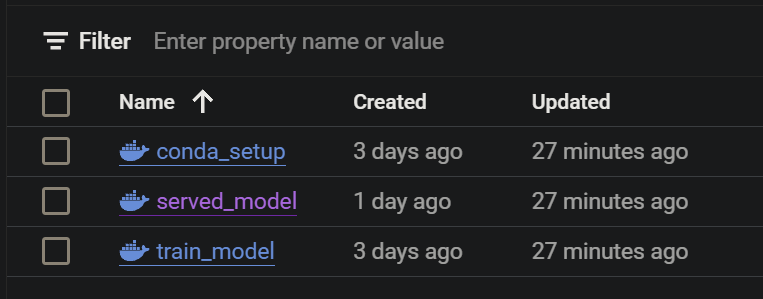
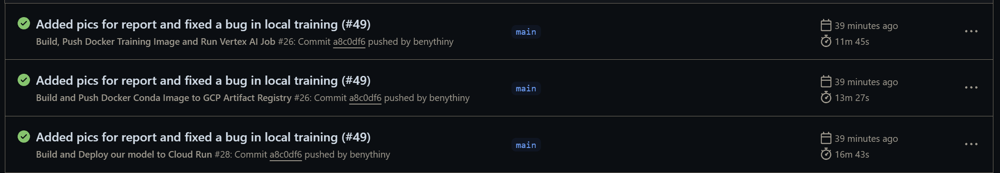

# Exam template for 02476 Machine Learning Operations

This is the report template for the exam. Please only remove the text formatted as with three dashes in front and behind
like:

`--- question 1 fill here ---`

where you instead should add your answers. Any other changes may have unwanted consequences when your report is auto
generated in the end of the course. For questions where you are asked to include images, start by adding the image to
the `figures` subfolder (please only use `.png`, `.jpg` or `.jpeg`) and then add the following code in your answer:

```markdown

```

In addition to this markdown file, we also provide the `report.py` script that provides two utility functions:

Running:

```bash
python report.py html
```

will generate an `.html` page of your report. After deadline for answering this template, we will autoscrape
everything in this `reports` folder and then use this utility to generate an `.html` page that will be your serve
as your final handin.

Running

```bash
python report.py check
```

will check your answers in this template against the constrains listed for each question e.g. is your answer too
short, too long, have you included an image when asked to.

For both functions to work it is important that you do not rename anything. The script have two dependencies that can
be installed with `pip install click markdown`.

## Overall project checklist

The checklist is _exhaustic_ which means that it includes everything that you could possible do on the project in
relation the curricilum in this course. Therefore, we do not expect at all that you have checked of all boxes at the
end of the project.

### Week 1

-   [x] Create a git repository
-   [x] Make sure that all team members have write access to the github repository
-   [x] Create a dedicated environment for you project to keep track of your packages
-   [x] Create the initial file structure using cookiecutter
-   [x] Fill out the `make_dataset.py` file such that it downloads whatever data you need and
-   [x] Add a model file and a training script and get that running
-   [x] Remember to fill out the `requirements.txt` file with whatever dependencies that you are using
-   [x] Remember to comply with good coding practices (`pep8`) while doing the project
-   [x] Do a bit of code typing and remember to document essential parts of your code
-   [x] Setup version control for your data or part of your data
-   [x] Construct one or multiple docker files for your code
-   [x] Build the docker files locally and make sure they work as intended
-   [x] Write one or multiple configurations files for your experiments
-   [x] Used Hydra to load the configurations and manage your hyperparameters
-   [x] When you have something that works somewhat, remember at some point to to some profiling and see if you can optimize your code
-   [x] Use Weights & Biases to log training progress and other important metrics/artifacts in your code. Additionally,
        consider running a hyperparameter optimization sweep.
-   [x] Use Pytorch-lightning (if applicable) to reduce the amount of boilerplate in your code

### Week 2

-   [x] Write unit tests related to the data part of your code
-   [x] Write unit tests related to model construction and or model training
-   [x] Calculate the coverage.
-   [x] Get some continuous integration running on the github repository
-   [x] Create a data storage in GCP Bucket for you data and preferable link this with your data version control setup
-   [x] Create a trigger workflow for automatically building your docker images
-   [x] Get your model training in GCP using either the Engine or Vertex AI
-   [x] Create a FastAPI application that can do inference using your model
-   [x] If applicable, consider deploying the model locally using torchserve
-   [x] Deploy your model in GCP using either Functions or Run as the backend

### Week 3

-   [x] Check how robust your model is towards data drifting
-   [x] Setup monitoring for the system telemetry of your deployed model
-   [x] Setup monitoring for the performance of your deployed model
-   [x] If applicable, play around with distributed data loading
-   [x] If applicable, play around with distributed model training
-   [x] Play around with quantization, compilation and pruning for you trained models to increase inference speed

### Additional

-   [x] Revisit your initial project description. Did the project turn out as you wanted?
-   [x] Make sure all group members have a understanding about all parts of the project
-   [x] Uploaded all your code to github

## Group information

### Question 1

> **Enter the group number you signed up on <learn.inside.dtu.dk>**
>
> Answer:

50

### Question 2

> **Enter the study number for each member in the group**
>
> Example:
>
> _sXXXXXX, sXXXXXX, sXXXXXX_
>
> Answer:

s240446, s212074, s240490, s240505, s233498

### Question 3

> **What framework did you choose to work with and did it help you complete the project?**
>
> Answer length: 100-200 words.
>
> Example:
> _We used the third-party framework ... in our project. We used functionality ... and functionality ... from the_ > _package to do ... and ... in our project_.
>
> Answer:

Pytorch Lightning: Framework for training our LTSM model and storing default config values, significantly reduced boilerplate
Forecasting: Abstracion above Pytorch Lightning working with Timeseries data (he results weren’t satisfying, so we leveraged the Pytorch LSTM module)
Docker: For reproducibility of the entire environment
Conda: Manage packages and python versions
DVC: Data versioning tool, similar is github but for data
OmegaConf: Handle the config data for `train_model.py`
CookieCutter: Template used for generating project sctructure
Weight and Biases: wandb, used for storing and tracking trained models
CodeCov: Tool for uploading coverage report from pytest as a comment to pull requests
Pytest: Runs tests to check whether the code is working as expected
GitHub: Versioning tool for written code, GitHub Actions runs pytest, Codecov, upload built docker images to GCP
GCP Cloud Storage: Stores data for dvc pull
GCP Artifact Registry: Stores built docker images (can be created into container)
GCP Compute Engine: Enables creating virtual machines
GCP Functions / Run: Deployment
GCP Vertex AI: includes virtual machines, training of AI models ("abstraction above VM with useful features for Data Science, machine learning and deep learning")

## Coding environment

> In the following section we are interested in learning more about you local development environment.

### Question 4

> **Explain how you managed dependencies in your project? Explain the process a new team member would have to go** > **through to get an exact copy of your environment.**
>
> Answer length: 100-200 words
>
> Example:
> _We used ... for managing our dependencies. The list of dependencies was auto-generated using ... . To get a_ > _complete copy of our development environment, one would have to run the following commands_
>
> Answer:

To get a complete copy of our development environment, we offer two methods:

The first method involves creating a Conda environment with the correct python version, installing dependencies, and downloading the data:

```
git clone https://github.com/malek-luky/Automatic-Wheel-Assembly-Detection.git
conda env create -f environment.yml
conda activate DTU_ML_Ops
dvc pull
```

The second method uses Docker. This approach builds an image of our entire project
and runs it in a container, which includes all dependencies, data, and code
necessary for running the project. We offer two options for this:

**Option 1:**
Build the container locally after downloading the repository.

```
git clone https://github.com/malek-luky/Automatic-Wheel-Assembly-Detection.git
cd Automatic-Wheel-Assembly-Detection
docker build -f dockerfiles/<train_model/conda_setup/deploy_model>.dockerfile . -t image-name:latest
```

You can then run the container with the following command. (Note if you have access to our GCP project, you don't have to set the WANDB_API_KEY environment variable. Because we automatically take it from the Secret Manager)

```
docker run -e WANDB_API_KEY=<your-wandb-api-key> -it image-name:latest
```

**Option 2:**

Since we host our images in the Artifact registry, you can pull the image from there and run it locally. To simplify, we created commands in a Makefile. You can run the following commands:

```

make docker_<CONDA/TRAIN/DEPLOY>_online

```

### Question 5

> **We expect that you initialized your project using the cookiecutter template. Explain the overall structure of your** > **code. Did you fill out every folder or only a subset?**
>
> Answer length: 100-200 words
>
> Example:
> _From the cookiecutter template we have filled out the ... , ... and ... folder. We have removed the ... folder_ > _because we did not use any ... in our project. We have added an ... folder that contains ... for running our_ > _experiments._
>
> Answer:

We initialised our project with a cookiecutter template. The description of the individual folders can be seen in our We added folders `deployment/torchserve` and our code additionally creates a folder `/serve_model` that stores the currently deployed model for supporting local and cloud model deployment respectively. We added a folder `src/models/config` for storing hyper parameters locally and Vertex AI config. We renamed the project folder to `src`, where all the necessary source files for data and model usage are stored.
The models folder in the root (gitignored - but created when training a new model) is used for storing the saved models.
The tests folder contains unit tests for data and model correctness.
The .github/workflows folder contains workflows that are executed either on pull requests or pushes to main.
The .dvc folder contains configuration for DVC usage.
The dockerfiles folder contains three docker files with the instruction for building docker images. For more information visit our [Github Readme](https://github.com/malek-luky/Automatic-Wheel-Assembly-Detection/blob/main/README.md) where in the _Project Structure_ section everything is explained in much more details.

### Question 6

> **Did you implement any rules for code quality and format? Additionally, explain with your own words why these** > **concepts matters in larger projects.**
>
> Answer length: 50-100 words.
>
> Answer:

We established the GitHub Pre-commit to ensure code quality and formatting. The pre-commit configuration file prevents the pushing of large files to the repository, checks for trailing whitespaces, correctly fixes the ends of files, and sorts packages in requirements.txt alphabetically. Moreover we utilize ruff to check and auto-format most code inconsistencies to conform with the PEP8 standard. Lastly, pre-commit uses the isort package to properly organize imports in Python scripts. Ensuring a consistent code style and formatting is important in larger projects to facilitate code readability and maintainability. It also helps to avoid unnecessary merge conflicts inside the team.

## Version control

> In the following section we are interested in how version control was used in your project during development to
> corporate and increase the quality of your code.

### Question 7

> **How many tests did you implement and what are they testing in your code?**
>
> Answer length: 50-100 words.
>
> Example:
> _In total we have implemented X tests. Primarily we are testing ... and ... as these the most critical parts of our_ > _application but also ... ._
>
> Answer:

We implemented 5 tests in total. Primarily we are testing the data from the dataset, checking its dimension, the size of every data sample, the correctness of data storage. We also test the model structure by evaluating the output shape, the correctness of the hyperparameters and the correctness of data samples partitioning.

### Question 8

> **What is the total code coverage (in percentage) of your code? If you code had an code coverage of 100% (or close** > **to), would you still trust it to be error free? Explain you reasoning.**
>
> Answer length: 100-200 words.
>
> Example:
> *The total code coverage of code is X%, which includes all our source code. We are far from 100% coverage of our \*\* > *code and even if we were then...\*
>
> Answer:

The total coverage of our tests is $58\%$. We are far from $100\%$ coverage of our code and even if we were then we would still not trust it to be error free. The reason for this is that the coverage only tells us how much of the code is tested, but not how well it is tested. For example, we could have a function that is tested, but the test is not testing the function properly. Therefore, we would still not trust the code to be error free. However, the coverage is a good indicator of how well the code is tested. The higher the coverage, the more likely it is that the code is tested properly.

### Question 9

> **Did you workflow include using branches and pull requests? If yes, explain how. If not, explain how branches and** > **pull request can help improve version control.**
>
> Answer length: 100-200 words.
>
> Example:
> _We made use of both branches and PRs in our project. In our group, each member had an branch that they worked on in_ > _addition to the main branch. To merge code we ..._
>
> Answer:

We developed features on separate branches, creating pull requests for frequent merges into the main branch. This streamlined our process, minimising the risk of excessive branches and reducing potential merge conflicts. The ownner of the repository also locked the main branch for direct commits, therefore everything going to the main branch was done using PR. For PR we forced the squash commit. Therefore most of the pushes (except the forced ones) to the main branch have a PR with description what was implemented in this features. This approach gives us better control over the code. Also, we implemented one workflow so that on every pull request to the main branch it conducts tests from the `/tests` folder. There are other three workflows for pushes to the main branch: first one builds and pushes the docker training image and runs Vertex AI Job; the second one builds and pushes docker conda image to GCP Artifact Registry; the third one builds and deploys our model to Cloud Run.

### Question 10

> **Did you use DVC for managing data in your project? If yes, then how did it improve your project to have version** > **control of your data. If no, explain a case where it would be beneficial to have version control of your data.**
>
> Answer length: 100-200 words.
>
> Example:
> _We did make use of DVC in the following way: ... . In the end it helped us in ... for controlling ... part of our_ > _pipeline_
>
> Answer:

Yes, we are using dvc for version control. Since our project relies on manually labeled data from the lab, versioning makes perfect sense. We can receive new data on a daily basis and version it, so then we want to reproduce model training from last month to find a glitch for example in the model we trainer a month ago, we can easily do it. We just need to find the correct data label from that day and download new dataset for the training. However, since the lab gave us only initial meassurements in the first week of the course. We did not try out this feature. Also, more data would be very helpful for us, since the main problem with the model was a lack of data.

### Question 11

> **Discuss you continues integration setup. What kind of CI are you running (unittesting, linting, etc.)? Do you test** > **multiple operating systems, python version etc. Do you make use of caching? Feel free to insert a link to one of** > **your github actions workflow.**
>
> Answer length: 200-300 words.
>
> Example:
> _We have organized our CI into 3 separate files: one for doing ..., one for running ... testing and one for running_ > _... . In particular for our ..., we used ... .An example of a triggered workflow can be seen here: <weblink>_
>
> Answer:

Our Continuous Integration (CI) setup is organized into four distinct workflows, each serving a specific purpose within our development pipeline:

1. **Artifact Deployment:** This workflow is responsible for deploying an image of the entire project to the artifact registry. The deployed image can be then used and run via a Virtual Machine in the cloud, ensuring seamless scalability and accessibility.

2. **Model Training:** This workflow deploys an image containing the training script alongside all its dependencies. It then proceeds to train a new model using Vertex AI, leveraging google's machine learning infrastructure.

3. **Model Hosting:** Focused on real-time interaction, this workflow deploys an image of our hosted model using FastAPI and uvicorn. It then deploys the setup to Cloud Run, ensuring our model is accessible to end users for immediate, scalable predictions of correct tire assembly on wheels.

4. **Unit Testing:** This workflow uses pytest to conduct unit testing. It ensures the correctness of our model and data by validating the model architecture. This is achieved for example, by passing example inputs and verifying the expected output shape.

These workflows are triggered upon any changes to the main branch. The main branch is locked to pushes, only allowing changes via Pull Requests (PRs), and is further protected to ensure that only non-breaking changes are integrated (by running the testing workflow on every PR).

An example of our workflow, showcasing the deployment of our model to Cloud Run, can be viewed [here](https://github.com/malek-luky/Automatic-Wheel-Assembly-Detection/blob/main/.github/workflows/build_deploy.yml).

Additionally, we employ a pre-commitizer within our repository. This tool helps in maintaining high coding standards by enforcing quality checks, such as the elimination of trailing whitespaces and unused imports,

## Running code and tracking experiments

> In the following section we are interested in learning more about the experimental setup for running your code and
> especially the reproducibility of your experiments.

### Question 12

> **How did you configure experiments? Did you make use of config files? Explain with coding examples of how you would** > **run a experiment.**
>
> Answer length: 50-100 words.
>
> Example:
> _We used a simple argparser, that worked in the following way: python my_script.py --lr 1e-3 --batch_size 25_
>
> Answer:

The hyperparameters are stored under `src/model/config/default_config.yaml` and by default are loaded to the training script with the use of omegaconf. The stored parameters are: the number of epochs, batch size, size of a hidden layer, output size and sequence length. We implemented CLI with `click` to choose different training modes. Running the script with

```bash
python src/models/train_model.py --sweep
```

results in hyper parameters optimization by `wandb`, where parameters are initialised with `wandb.config`.

### Question 13

> **Reproducibility of experiments are important. Related to the last question, how did you secure that no information** > **is lost when running experiments and that your experiments are reproducible?**
>
> Answer length: 100-200 words.
>
> Example:
> _We made use of config files. Whenever an experiment is run the following happens: ... . To reproduce an experiment_ > _one would have to do ..._
>
> Answer:

To have reproducible results we need two things:  same software and ideally also exactly the same hardware. For the software side of view, we are using versioning on GitHub, config files using OmegaConf, dvc for data, and conda for the same python and dependencies versions. This ensures that at any point in the time, we can get exactly the same setup to reproduce the model.

Shipping entire computer is not an easy (and right thing) to do. Inside the dockerfile, we exactly specify what setup we are using. The packages are described inside the environemnt.yml (since our docker is using conda which can often automatically solve the conflicts between packages). Therefore when we want to reproduce our meassurements. Not only that we have exactly the specs of our computer, but even if we decide to use e.g. different packages or entrypoint, we can just checkout the commmit on git and reproduce the experiment from the past.

Using proper versioning and often commits ensures that no information is lost when running experiments. Additionally, using tools such as Weights & Biases to log training progress and other important metrics/artifacts in your code, helps to keep track of the experiments and their results.

### Question 14

> **Upload 1 to 3 screenshots that show the experiments that you have done in W&B (or another experiment tracking** > **service of your choice). This may include loss graphs, logged images, hyperparameter sweeps etc. You can take** > **inspiration from [this figure](figures/wandb.png). Explain what metrics you are tracking and why they are** > **important.**
>
> Answer length: 200-300 words + 1 to 3 screenshots.
>
> Example:
> _As seen in the first image when have tracked ... and ... which both inform us about ... in our experiments._ > _As seen in the second image we are also tracking ... and ..._
>
> Answer:

We primarily use Weights and Biases service for monitoring the progress of the experiments. Here you can see an example of the training loss we captured, which is one of the metrics we measure. The training loss provides information of how well our model is learning, and our objective is to minimise it. Although this metric is essential for tracking the learning progress of the model, due to the lack of data for a proper training, the training loss curve might not seem as decreasing as it would have been desired.

> 

Another metric we track is the training accuracy, which in contrast to training loss demonstrates how well the model is classifying the target values. Again, the shown graph is far from demonstrating a perfect result after training, even though the resulting 78 % is a quite good value it is important to note, that our our true/false labels are heavily unbalanced making the model to be perceived as good even though that does not have to be true. Noting metrics such as recall and precision could have helped more. Ideally by monitoring the loss and accuracy we should be able to fine-tune our model and achieve better results.


We were performing hyper parameters optimization with the `wandb` `sweep` feature. The result can be seen in the following picture. The tuning parameter was the size of the hidden layer and the objective was to minimise the training loss.


### Question 15

> **Docker is an important tool for creating containerized applications. Explain how you used docker in your** > **experiments? Include how you would run your docker images and include a link to one of your docker files.**
>
> Answer length: 100-200 words.
>
> Example:
> _For our project we developed several images: one for training, inference and deployment. For example to run the_ > _training docker image: `docker run trainer:latest lr=1e-3 batch_size=64`. Link to docker file: <weblink>_
>
> Answer:

We have three different dockerfiles. First one is used for training the model: [Dockerfile 1](https://github.com/malek-luky/Automatic-Wheel-Assembly-Detection/blob/main/dockerfiles/train_model.dockerfile). This dockerfile downloads all the required packages and starts the training script, which loads the training data from a GCP bucket and trains the model and uploads it to wandb model registry. The second dockerfile deploys the model to Cloud Run and exposes the prediction endpoint: [Dockerfile 2](https://github.com/malek-luky/Automatic-Wheel-Assembly-Detection/blob/main/.github/workflows/build_deploy.yml). The FastAPI app that hosts our model is containerlized and deployed to Cloud Run. The app is then additionally responsible for downloading the newest model and predicts a label (correct/incorrect assembly) based on the input of an end user. The last dockerfile creates an image of our entire project. It downloads the packages and waits. This allows the user run the container in an interactive mode for debugging or running any of our scripts.

When the images are built you can run them with the following commands:
(if you have access to our GCP project, you dont have to specify the `-e` flag, as we take the API key from the Secret Manager).

```
docker run -e WANDB_API_KEY=<API KEY> train_model:latest
docker run -e WANDB_API_KEY=<API KEY> conda_setup:latest
docker run -e WANDB_API_KEY=<API KEY> deploy__model:latest
```

### Question 16

> **When running into bugs while trying to run your experiments, how did you perform debugging? Additionally, did you** > **try to profile your code or do you think it is already perfect?**
>
> Answer length: 100-200 words.
>
> Example:
> _Debugging method was dependent on group member. Some just used ... and others used ... . We did a single profiling_ > _run of our main code at some point that showed ..._
>
> Answer:

Based on the spectrum of work each group member was working on, the debugging methods were differing. Mostly when encountering bugs in the code during experiments, all of us used the debugging approach that involved first reviewing the code and error messages for issue identification. Locally, we utilised the built-in debugger in Visual Studio Code and employed print statements when needed. Some of us were also consulting TAs on the slack channel of this course, when the source of the bug was unclear. Some of the problems were solved by properly reading online documentation for the used packages or diving into their source codes.

Debugging on the cloud was more challenging, as we had to rely on the error messages and logs from the cloud services. Also the debugging loop took much longer, since we had to wait for the images to re-build and deploy them back to the cloud, to see if the errors were fixed. We did attempt to profile our code, but since the training was quite fast, due to the small dataset and simple model, we did not experience any performance issues.

## Working in the cloud

> In the following section we would like to know more about your experience when developing in the cloud.

### Question 17

> **List all the GCP services that you made use of in your project and shortly explain what each service does?**
>
> Answer length: 50-200 words.
>
> Example:
> _We used the following two services: Engine and Bucket. Engine is used for... and Bucket is used for..._
>
> Answer:

We are using Cloud Storage for storing data for dvc pull. Artifact Registry is responsible for storing our built docker images. Compute Engine enables creating virtual machines, which we used before moving to Vertex AI. Functions and Cloud Run were used for Model Deployment (here we are using Cloud Run, as it is more robust. Cloud Logging was used for fixing bugs. Cloud Monitoring was used to monitor read and write operations on the bucket and requests to the deployed model.
And last one on the list is Vertex AI, where we utilized its custom jobs to train our ML models.

### Question 18

> **The backbone of GCP is the Compute engine. Explained how you made use of this service and what type of VMs** > **you used?**
>
> Answer length: 100-200 words.
>
> Example:
> _We used the compute engine to run our ... . We used instances with the following hardware: ... and we started the_ > _using a custom container: ..._
>
> Answer:

We used Compute Engine to run our custom containers to test the training of our model in cloud. Luckily, in our case the training was rather fast, since we were using very simple model and a small dataset. But in case we have a huge model and enormous ammount of data, running it locally would mean we cannot use the PC for quite some time and also the computational power would not be sufficient. VM offer us to customize the machine to our needs and use even for instance TPUs, which are especially made for machine learning computations.

For our project we used the following settings: Compute-optimized, Series: C2D, Machine Type: c2d-standard-4 (must have at least 16GB RAM), Boot disk: 40 GB. Everything was deployed with a custom container image, mostly the dockerfile for training.

### Question 19

> **Insert 1-2 images of your GCP bucket, such that we can see what data you have stored in it.** > **You can take inspiration from [this figure](figures/bucket.png).**
>
> Answer:

The data was created by running our `make_dataset.py` script.


### Question 20

> **Upload one image of your GCP container registry, such that we can see the different images that you have stored.** > **You can take inspiration from [this figure](figures/registry.png).**
>
> Answer:



### Question 21

> **Upload one image of your GCP cloud build history, so we can see the history of the images that have been build in** > **your project. You can take inspiration from [this figure](figures/build.png).**
>
> Answer:

We were facing issues with building the image in GCP, because of underlying issues with dvc command and cloud build. Therefore after a discussin with Nicki we build the images using GitHub Actions and store them in Artifact registry instead.



### Question 22

> **Did you manage to deploy your model, either in locally or cloud? If not, describe why. If yes, describe how and** > **preferably how you invoke your deployed service?**
>
> Answer length: 100-200 words.
>
> Example:
> _For deployment we wrapped our model into application using ... . We first tried locally serving the model, which_ > _worked. Afterwards we deployed it in the cloud, using ... . To invoke the service an user would call_ > _`curl -X POST -F "file=@file.json"<weburl>`_
>
> Answer:

We managed to deploy our model both locally and in the cloud. For local deployment we utilised such packages as `torchserve` and `curl`. For this purpose it was also needed to implement our own `handler` for `torch-model-archiver`. The guidelines for local deployment are stored in the `README.md` under `/torchserve`. To get predictions from the local server, one would call:

```bash
curl http://127.0.0.1:8080/predictions/TireAssemblyLSTM -T example_tensor.txt
```

After being able to invoke the model locally, we developed a FastAPI application, which automatically downloads the newest trained model from Weights & Biases model registry. It then loads the state dictionary into our model architecture and makes a prediction via our `/predict` endpoint. The app every 6 hours checks for a new trained model and updates the running app with it. Additionally to our `/predict` endpoint, the app also exposes a root endpoint `/` and a `/healthcheck` endpoint.

The app is on every push to `main` branch containarilized and deployed to a publicly available Cloud Run service.

One can invoke the model by running this command in the terminal. (Please note that the cloud run instance is cold start, which means that you might need to refresh it and wait for it to start for the first time its being invoked).

```
curl -X 'POST' \
  'https://deployed-model-service-t2tcujqlqq-ew.a.run.app/predict' \
  -H 'accept: application/json' \
  -H 'Content-Type: application/json' \
  -d '{
    "sequence": [
        [0.1, 0.2, 0.3, 0.2, 0.3, 0.4, 0.2, 0.1],
        [0.2, 0.3, 0.4, 0.3, 0.4, 0.5, 0.3, 0.2],
        [0.1, 0.2, 0.3, 0.2, 0.3, 0.4, 0.2, 0.1],
        [0.1, 0.2, 0.3, 0.2, 0.3, 0.4, 0.2, 0.1],
        [0.1, 0.2, 0.3, 0.2, 0.3, 0.4, 0.2, 0.1],
        [0.1, 0.2, 0.3, 0.2, 0.3, 0.4, 0.2, 0.1],
        [0.1, 0.2, 0.3, 0.2, 0.3, 0.4, 0.2, 0.1],
        [0.1, 0.2, 0.3, 0.2, 0.3, 0.4, 0.2, 0.1],
        [0.1, 0.2, 0.3, 0.2, 0.3, 0.4, 0.2, 0.1],
        [0.2, 0.3, 0.4, 0.3, 0.4, 0.5, 0.3, 0.2]
    ]
}'
```

### Question 23

> **Did you manage to implement monitoring of your deployed model? If yes, explain how it works. If not, explain how** > **monitoring would help the longevity of your application.**
>
> Answer length: 100-200 words.
>
> Example:
> _We did not manage to implement monitoring. We would like to have monitoring implemented such that over time we could_ > _measure ... and ... that would inform us about this ... behaviour of our application._
>
> Answer:

We did not manage to implement monitoring of the deployed model which could be a significant improvement to the entire lifecycle of the project. Being able to continously check and analyse the performance of the model would help us to early detect the decrease in the model's predictive capabilities (e.g. preventing data drifting where the distribution of the most recent data does not fit with the distribution of the data the model was originally trained on). This would ensure the success of the application among end users in a long run. Furthermore, regular monitoring could help to quickly identify and diagnose errors in the model's predictions which would lead to a quicker troubleshooting and resolution.

### Question 24

> **How many credits did you end up using during the project and what service was most expensive?**
>
> Answer length: 25-100 words.
>
> Example:
> _Group member 1 used ..., Group member 2 used ..., in total ... credits was spend during development. The service_ > _costing the most was ... due to ..._
>
> Answer:

During the 3 weeks we spent a total of 17 dollars on all the services in the project. The most expensive service ended up being Artifact Registry, which we used to store all our images. Our docker images ended up being quite big and in the beginning we stored _all_ the images with a different tag (commit sha) if we needed to return to a previous version of that image, this ended up being quite costly. On the other hand, money spent on compute resources was quite low, because of the lack of complexity in our data and model architecture.

## Overall discussion of project

> In the following section we would like you to think about the general structure of your project.

### Question 25

> **Include a figure that describes the overall architecture of your system and what services that you make use of.** > **You can take inspiration from [this figure](figures/overview.png). Additionally in your own words, explain the** > **overall steps in figure.**
>
> Answer length: 200-400 words
>
> Example:
>
> _The starting point of the diagram is our local setup, where we integrated ... and ... and ... into our code._ > _Whenever we commit code and puch to github, it auto triggers ... and ... . From there the diagram shows ..._
>
> Answer:

The diagram is something we are really proud of. To make it easy to understand, we seperated the diagram into three different parts.

The first one is the data analyst. In our case, we got the labelled meassurement by the lab, we had to store them on GCP bucket and version them via DVC. Also, we put into this part the monioring. Since the data can be sensitive to data drifting or bugs resulting in much worse performance, we need to analyze the data over time. To automate this process and immediatelly alert us when something goes wrong, we experimented with Slack and SMS notification.

The next part is the user, which is fairly simple. Via a command line and firendly user interface, they run the server using cloud run, that run the dockerfile from artifact registry, that downloads the newest model from Wandb model registry and makes the prediction, which is sent back to the user.

The developer's task is the most complicated. After writing new changes and pushing to github and making PR, Github Actions trigger three important workflows. First one runs the pytets and uplods the coverage report to the PR as a comment, the training one build the docker image (using conda) and upload them to Artifact registry. From there, Vertex AI pulls the training image to train the model using Pytorch Lightning and when the training is finished, uploads the model to wandb. The other deploy the model, which means that it builds the image and uploads it to artifact registry, then the cloud run is triggered, which pulls the image that starts the server. If that fails the GitHub workflow will result in an error.


### Question 26

> **Discuss the overall struggles of the project. Where did you spend most time and what did you do to overcome these** > **challenges?**
>
> Answer length: 200-400 words.
>
> Example:
> _The biggest challenges in the project was using ... tool to do ... . The reason for this was ..._
>
> Answer:

The first challenge we encountered was creating a custom architecture for our model, as our study case was quite unique. Our first approach was to implement the model with `TemporalFusionTransformer` using Pytorch Forecasting, but this didn’t bring positive results, so we switched to pure Pytorch instead.

The next struggle was building the docker image inside GCP. It got stuck and after discussing the problem with Nicki we decided to buidl the image using github actions and then upload the built image to GCP.

Another big issue we encountered was while running the train_model docker image. Accidentally the entry point was a wrong function that was used in conda_setup dockerfile, which had only one job, never exit the docker container. After spending nearly one day debugging the issue why the dockerfile does not work, we found this bug.

The biggest struggle was with VM machines. Since the image is quite big, we were incrementally increasing the disk size for our VM. Unfortunately, except the disk size we were facing an issue with wandb-api token. Therefore we added the wandb token to the instance, and afer running into with a disk size we created a new more powerful instance. But we did not save the wanndb-api-token. Therefore we were debugging the disk size for 6 hours and all possible problems, but the issue was elsewhere.

Last but not least. we had a fun issue with GitHub workflow, where we wanted to automatically mirror the requirements into environment for conda, so we do not have to add each requirements to both files. But the workflow must commit using GitHub bot, which is not allowed to push to protected branches. But if we push to the current branch, we would loop the workflow that is executed during the commit. We solved it using precommit.

### Question 27

> **State the individual contributions of each team member. This is required information from DTU, because we need to** > **make sure all members contributed actively to the project**
>
> Answer length: 50-200 words.
>
> Example:
> _Student sXXXXXX was in charge of developing of setting up the initial cookie cutter project and developing of the_ > _docker containers for training our applications._ > _Student sXXXXXX was in charge of training our models in the cloud and deploying them afterwards._ > _All members contributed to code by..._
>
> Answer:

-   Liza (s240446) provided dataset, contributed to unit tests, wandb setup and sweeping, CLI, config files, report filing, implemented local deployment with torchserve.

-   Vratislav (s240490) implementation of the data processing pipeline, pre-commit setup, documentation, report filling

-   Lukas R. (s233498) created model architecture and training script, implemented cloud deployment of our trained model (fastapi, dockerfile, github action, cloud setup) to Cloud Run, implemented automatic model training (dockerfile, github actions, cloud setup) to Vertex AI, set up dvc for the repository and configured it with Cloud Storage, set up Weights ad Biases project (store API key in Secret Manager to ensure all our services that train & access our trained models can use our wandb project), created a logging module, report filling

-   Student s212074 (Lukas) created the intiial template using cookiecutter, organized code on GitHub, made the unittests for data and pytests workflow, automated coverage report commenents on PR, created Makefile commands, contributed to README, report and made the project diagram, deployed the MkDocs, ran the dockerfiles on VM, implemented the model upload to wandb together with Slack notification, experimented with GCP Cloud Function, created Monitoring dashbaord and SMS alerts on GCP and tested the functionality implemented by Lukas
